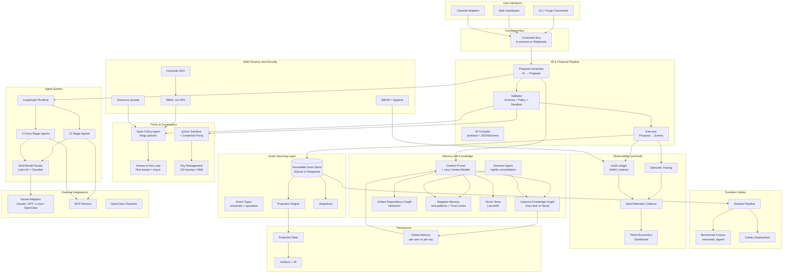

# Software Requirements Specification
## Forge OS — Deterministic Event-Driven Engineering Runtime
**Version 4.1 — Production-Grade Buildable SRS**
**Date:** 2026-05-10
**Status:** Authoritative for implementation

---

## About this version

v4.1 supersedes v3.1 and v4.0. It applies a three-pass hardening to v4.0:

1. **Truth-in-claims pass.** Removes or scopes any requirement that cannot be implemented as written. Replaces fabricated dependencies with real ones. Acknowledges archived upstreams. Tiers performance numbers to deployment topology.
2. **Reconciliation pass.** Resolves contradictions between sections (multi-tenancy ↔ global memory; HMAC ledger ↔ Sigstore; hot-reload policy ↔ replay determinism; diagram ↔ text).
3. **Scope-and-schedule pass.** Splits the program into a buildable MVP, a Production tier, and an Enterprise tier — each with a credible team size and timeline.

All v3.1 functional requirements (FR-OE-001 through FR-TE-003) are preserved with corrections noted. All v4.0 additions (FR-IR through FR-NEG) are preserved with corrections noted. Four new requirement groups are added (FR-KEY, FR-EVO, FR-DDB, FR-COST). Every change from v4.0 is annotated with `[v4.1: …]` so reviewers can see the delta.

---

## Table of Contents

1. [Introduction](#1-introduction)
2. [Overall Description](#2-overall-description)
3. [System Features (Functional Requirements)](#3-system-features-functional-requirements)
4. [External Interface Requirements](#4-external-interface-requirements)
5. [Non-Functional Requirements](#5-non-functional-requirements)
6. [System Architecture](#6-system-architecture)
7. [Implementation Roadmap](#7-implementation-roadmap)
8. [Risk Register](#8-risk-register)
9. [Appendices](#9-appendices)

---

## 1. Introduction

### 1.1 Purpose

Forge OS is a **deterministic, event-driven engineering runtime** that orchestrates the complete software development lifecycle through a pipeline of specialized AI agents, multi-modal quality gates, and a continuous cross-project learning memory system.

Its defining property is the **deterministic boundary**: AI agents *propose* state changes, but a deterministic validator and executor decide what — if anything — gets committed to an immutable, append-only event store. Current state is always derived by replaying events. This makes Forge OS auditable, reversible, replayable, and safe under autonomous operation in a way that pure agent frameworks are not.

Forge OS is kernel-agnostic (Claude, GPT, OpenClaw, local models, or human-in-the-loop) and works on a developer's laptop or scales to a multi-tenant cluster.

### 1.2 Scope

The system encompasses:

- A **12-stage SDLC pipeline** (extensible) from requirements gathering to post-release retrospectives.
- **16 specialized agents** (12 stage + 4 cross-stage) with persona-based tool restrictions and scoped context.
- **Multi-modal quality gates** with risk classification (LOW/MEDIUM/HIGH/CRITICAL).
- A **three-tier memory architecture** (session → project → global) implemented as a Lessons Knowledge Graph (LKG) and an Artifact Dependency Graph (ADG).
- An **Engineering Intermediate Representation (IR)** — versioned, schema-driven, source-of-truth for all artifacts.
- An **event-sourced core** — every state change is an immutable signed event; current state is a projection.
- A **deterministic proposal/validator/executor** boundary between AI output and committed state.
- A **policy engine (Open Policy Agent)** for governance decisions.
- **Shadow evaluation and canary deployment** for safe evolution of the pipeline itself.
- **Cognitive observability** — semantic tracing of reasoning, memory attribution, hallucination tracking.
- A **multi-model execution router** with task classification and budget-aware routing.
- **Supply-chain security** (SBOM, Sigstore signing) with explicitly bounded reproducibility.
- **Multi-tenancy** (organizations → projects → workspaces) with RBAC and quotas.
- **Negative memory** (anti-patterns) with trust classification and human-in-the-loop governance for `trusted` labels.
- **Self-learning loops** with bounded autonomy and reversibility.
- **Layered sandbox security** (gVisor + credential proxy + phase-based access control).
- **End-to-end observability** with a verifiable audit ledger.
- **Channel adapters** for stakeholder feedback and release broadcasting.
- A **community-pluggable extension ecosystem** via MCP.

### 1.3 Definitions, Acronyms, and Abbreviations

| Term | Definition |
|------|------------|
| **ADG** | Artifact Dependency Graph — directed graph of pipeline artifacts and their dependencies. |
| **Aggregate** | An event-sourcing concept; the entity (e.g. a project, a stage, a memory graph) whose state is derived from a stream of events. |
| **Audit Ledger** | Append-only HMAC-chained log of significant decisions, complementary to the Event Store. |
| **Capsule** | Token-optimized context unit (skeleton or full artifact form). |
| **Command Bus** | Internal event-distribution component that fans incoming requests (CLI, web, channel) to the proposal generator and event store consumers. |
| **Dreamer Agent** | Asynchronous agent that consolidates daily logs, applies confidence decay, and detects contradictions. |
| **Engineering IR** | Canonical, schema-driven representation of engineering knowledge (requirements, architecture, specs, plans, contracts, deployment topology). |
| **Event Store** | Immutable append-only log of all domain events; source of truth for state. |
| **Forge Skill** | Reusable agent procedure stored in `~/.forge/skill-library/`. |
| **Gate** | A checkpoint of multi-modal criteria that must be satisfied before a stage may advance. |
| **gVisor** | User-space kernel providing container isolation. |
| **HITL** | Human-in-the-Loop — structured approval checkpoints. |
| **IR Compiler** | Module that compiles IR into executable plans and validates IR consistency. |
| **Kernel** | Underlying AI execution environment (Claude, GPT, OpenClaw, local LLM, or human). |
| **LKG** | Lessons Knowledge Graph — graph of learned rules with confidence and relationships. |
| **MCP** | Model Context Protocol. |
| **OPA** | Open Policy Agent — policy-as-code engine using Rego. |
| **OTLP** | OpenTelemetry Protocol. |
| **Projection** | A read-only view of current state derived by replaying events. |
| **Proposal** | An AI-generated suggested state change, validated before any event is appended. |
| **Replay** | Reconstructing state by re-projecting events. **Note:** replay does not re-invoke AI agents; it deterministically re-projects committed events. |
| **Sandbox** | Restricted execution environment (gVisor container). |
| **SBOM** | Software Bill of Materials (SPDX or CycloneDX). |
| **SDLC** | Software Development Life Cycle. |
| **Semantic Trace** | A trace including reasoning steps, memory retrievals, rejected options, and confidence scores. |
| **Shadow Pipeline** | Duplicate runtime that re-projects events against candidate IR/policy/agent versions for safe testing. |
| **Two-Key Rule** | Security principle: two distinct identities required for initiation and approval of CRITICAL actions. |
| **Upcaster** | Function that migrates an old event payload to a new event-type version during projection. |

### 1.4 References

- IEEE 830-1998 — Recommended Practice for Software Requirements Specifications.
- OWASP Top 10 for LLM Applications (2025).
- OpenTelemetry Specification 1.x.
- Open Policy Agent — Rego language reference.
- Sigstore Cosign — keyless signing reference.
- SLSA Framework v1.0 — supply chain levels.
- Event Sourcing patterns — Greg Young, "CQRS Documents" and Vaughn Vernon, "Implementing DDD."

### 1.5 Document Conventions

- Functional requirement IDs are stable across versions: `FR-<group>-<nnn>`.
- `[v4.1: …]` annotations mark deltas from v4.0.
- Tiered NFRs use `MVP / Production / Enterprise` labels.
- "MUST" / "SHOULD" / "MAY" follow RFC 2119 semantics.

---

## 2. Overall Description

### 2.1 Product Perspective

Forge OS is a **lifecycle orchestration layer** that sits above the developer's coding environment. It is not embedded in any IDE. It interacts with:

- **AI kernels** through the Kernel Adapter Layer (LiteLLM-backed).
- **External tools** (test runners, linters, scanners) via MCP servers or sandboxed commands.
- **Human stakeholders** via CLI, web dashboard, and messaging channels.
- **Filesystem and git** for artifacts, IR, event store, knowledge graphs, and configuration.
- **Policy services** (OPA) and **sigstore** for governance and signing.

The system is **local-first by default** and **cluster-capable** for the Production and Enterprise tiers.

### 2.2 Product Functions

- Automate the SDLC from requirements through release retrospectives.
- Maintain a single source of truth (Engineering IR) for all artifacts.
- Enforce quality gates with deterministic and AI-reviewed criteria.
- Learn from corrections, repeated patterns, and cross-project experience — within bounded autonomy guardrails.
- Provide full provenance for every decision, tool call, and stage transition.
- Allow safe delegation of high-risk actions to humans through structured approvals with cryptographic identity.
- Scale from a single developer using the `minimal` profile to a regulated enterprise team with full governance.
- Continuously test its own components and propose evolutions, with shadow + canary safety nets.

### 2.3 User Characteristics

- **Primary user:** Software developer or engineer.
- **Secondary user:** Technical project manager / team lead.
- **Tertiary user:** Compliance officer auditing development practices.
- **Quaternary user:** Community contributor extending the ecosystem (agents, gates, kernel adapters, profile packs).

### 2.4 Operating Environment

| Tier | Topology | Default storage | Identity | Sandbox | Channels |
|------|----------|-----------------|----------|---------|----------|
| **MVP** | Single host, single user | SQLite (WAL) for events + projection cache | Local OS user | gVisor (optional) | None |
| **Production** | Single host or small VM, single team | SQLite + on-disk IR + LKG (Kùzu fork or NeuG) | Keycloak OIDC | gVisor required | OpenClaw or native adapter |
| **Enterprise** | Cluster (Kubernetes), multi-tenant | Redpanda/Kafka events + Postgres projections + Neo4j LKG | Keycloak SAML/OIDC + SCIM | gVisor + per-tenant network policy | Native Slack/Teams + OpenClaw optional |

OS support: Linux primary, macOS supported, Windows via WSL2 (sandbox features only on Linux/WSL2).
Runtime: Python 3.12+ (core); optional Node.js for OpenClaw if used.

### 2.5 Design and Implementation Constraints

- All persistent data MUST be stored in open, human-readable formats where practical (Markdown, YAML, JSON, GraphML, protobuf with `.proto` schema published).
- Every component (agent, gate, kernel adapter, channel adapter, policy bundle, event type) MUST be replaceable via a defined interface.
- The Kernel Adapter Layer MUST provide a language-agnostic interface definition (protobuf or JSON-RPC).
- No gate check, agent invocation, or daemon task may block indefinitely; all MUST have configurable timeouts and degradation strategies.
- The Event Store MUST be immutable and append-only. The Audit Ledger MUST be HMAC-chained AND verifiable offline.
- AI agent output MUST pass through the deterministic Proposal/Validator/Executor boundary before mutating state. This is non-negotiable in the Production and Enterprise tiers.

### 2.6 Assumptions and Dependencies

- The user has access to at least one AI kernel (local or remote).
- External tools (test runners, linters) are available in the execution environment or can be containerized.
- gVisor `runsc` is installed for sandboxed execution in Production/Enterprise tiers.
- Network connectivity is required for remote AI kernels and Sigstore (keyless mode); core pipeline logic works offline with a local kernel.

### 2.7 [v4.1] Bounded Autonomy Principle

A core tenet of Forge OS is **bounded autonomy**: any action the system can take autonomously is paired with (a) reversibility, (b) auditability, and (c) a hard ceiling on blast radius. Specifically:

- The Health Daemon, Dreamer, Skill Miner, and Lesson Extractor operate **only via the Proposal boundary** — they cannot mutate state directly.
- Auto-actions of severity > LOW require either a policy that explicitly permits them or HITL approval.
- All autonomously-marked anti-patterns and "trusted" lessons begin life as `ephemeral` and are promoted only on HITL approval (see §3.30).
- The Event Store is the single source of truth; every auto-action is replayable and reversible by reverting to a prior projection.

---

## 3. System Features (Functional Requirements)

> All v3.1 requirements (3.1–3.20) are preserved. v4.0 additions (3.21–3.30) are preserved. v4.1 adds 3.31–3.34 to close remaining gaps.

### 3.1 Orchestration Engine & SDLC Pipeline

| ID | Requirement | Acceptance Criteria |
|----|-------------|---------------------|
| FR-OE-001 | **Pipeline State Machine** — Maintain a 12-stage state machine (SRS → Product → Architecture → Spec → Plan → Build → Eval → Deploy → Monitor → Feedback → Resolve → Release). State is **derived from the Event Store** by projection; the legacy `pipeline/state.md` is a human-readable export only. *[v4.1: state files are derivative; events are authoritative.]* | All transitions are deterministic and recorded as events. `forge status` rebuilds state from events on demand. |
| FR-OE-002 | **Stage Entry Commands** — Provide a unified CLI/API to enter any stage (e.g. `forge stage start srs`). Engine verifies the previous gate passed before allowing entry. *[v4.1: a stage start emits a `StageStarted` event only after a validated proposal.]* | Blocked if gate not met; forced override available with admin role and explicit policy permission, recorded as `StageOverride` event. |
| FR-OE-003 | **Lifecycle Hooks** — Expose events `SessionStart`, `UserPromptSubmit`, `PreToolUse`, `PostToolUse`, `Stop`, `SubagentStop`, `SessionEnd` with registered hook scripts. *[v4.1: hooks are event consumers; they read events from the projection, they do not mutate state.]* | Hooks run in a defined order; failures logged and do not crash the session. |
| FR-OE-004 | **Async Workflow Dispatch** — When a stage requires an agent, the engine asynchronously spawns the specialized agent through the Kernel Adapter and monitors its progress. Multiple parallel agents allowed when working on disjoint aggregates. *[v4.1: parallelism is bounded by aggregate-id; two agents may not produce concurrent proposals on the same aggregate.]* | Engine handles N parallel agents on disjoint aggregates without state conflicts. |
| FR-OE-005 | **Resume & Status** — `forge status` and `forge resume` display current pipeline position, active agents, and next steps; resume restores full context from the Event Store and memory tier. | Works across sessions; context reconstructed identically after restart by replaying events. |

**[v4.1] Implementation note.** The state machine is implemented using `python-statemachine` 3.x as the in-memory transition engine, with persistence delegated entirely to the Event Store. (The fabricated `and-action` library named in the v3.1 tech spec is replaced.)

### 3.2 Kernel Adapter Layer

| ID | Requirement | Acceptance Criteria |
|----|-------------|---------------------|
| FR-KA-001 | **Adapter Interface** — Formal interface (`IKernelAdapter`) with `get_capabilities()`, `spawn_agent(persona, context, tools)`, `on_event(event)`, `sync_memory()`. | Interface is language-agnostic and documented as protobuf. |
| FR-KA-002 | **Capability Introspection** — Adapter reports available tools, MCP servers, agent types, hook support, deterministic-output support. | Forge OS Capability Manager merges with stage requirements. |
| FR-KA-003 | **Multiple Implementations** — Reference adapters for Claude, OpenAI, OpenClaw, local LLM (Ollama), and a "Human" adapter; ecosystem supports adapter plugins. | User switches kernels by config change; no core code change required. |
| FR-KA-004 | **Tool Mapping** — Adapter translates abstract tool permissions (`Read`, `Write`, `Bash`, etc.) into kernel-specific tool calls. | Access enforced even if the kernel exposes more tools. |
| FR-KA-005 | **Event Translation** — Adapter receives lifecycle events in normalized form and returns responses the engine understands. | Hooks remain kernel-agnostic. |

### 3.3 Specialized Agent System

| ID | Requirement | Acceptance Criteria |
|----|-------------|---------------------|
| FR-AG-001 | **16 Pre-defined Agents** — 12 stage agents (Requirements Analyst, Product Designer, System Architect, Spec Writer, Planner, Builder, Evaluator, DevOps, Observer, Triage, Resolver, Release Manager) + 4 cross-stage (Reflector, Lesson Extractor, Skill Miner, Gate Checker). | Each has a YAML persona file with role, goal, allowed tools, allowed paths, output contract. |
| FR-AG-002 | **Scoped Context Injection** — Context Pruner provides only relevant artifacts and lessons based on stage and ADG. | Context size always under configured token budget. |
| FR-AG-003 | **Agent-Specific Tool Restrictions** — Agents may only use a subset of available tools. Restrictions enforced at the orchestration layer AND in sandbox policy. | Builder cannot execute Bash outside sandbox; Architect cannot write to source directories. |
| FR-AG-004 | **Output Contract Enforcement** — Each agent must produce a defined set of artifacts. Validator enforces output contracts at the proposal stage. *[v4.1: enforcement now happens via the Validator rather than post-hoc by the Gate Checker.]* | Missing or malformed artifact → proposal rejected before any event is appended. |

### 3.4 Gate Enforcement & Quality Evaluation

| ID | Requirement | Acceptance Criteria |
|----|-------------|---------------------|
| FR-GT-001 | **Multi-modal Gate Criteria** — Types: `FileExistence`, `PatternMatch`, `LLMReview`, `ExternalCommand`, `MetricThreshold`. Each carries a risk level (LOW, MEDIUM, HIGH, CRITICAL). | A stage may have criteria from all types; evaluated in parallel where possible. |
| FR-GT-002 | **Gate Check on Stage Advance** — Gate Coordinator evaluates all criteria at advance attempts. Failures block advancement (excluding warnings). | Blocked stages display unmet criteria and remediation tips. |
| FR-GT-003 | **In-Session Nudging** — `PreToolUse` and `PostToolUse` hooks may continuously check soft criteria and nudge agents without blocking. | Agents receive notifications like "Warning: raw color detected; use --color-primary-500". |
| FR-GT-004 | **Quantitative Evaluation** — `ExternalCommand` and `MetricThreshold` execute real tools (pytest, lighthouse, npm audit) inside the sandbox and parse output. | Test results, coverage, scores extracted and compared against thresholds. |
| FR-GT-005 | **Gate Criteria Versioning** — Gates are versioned alongside policy bundles. *[v4.1: gate version is recorded on every `GatePassed`/`GateFailed` event so replay is deterministic.]* | Old criteria archived; changes logged in audit ledger AND embedded in events. |
| FR-GT-006 | **[v4.1] LLMReview Determinism Guard** — `LLMReview` criteria are non-deterministic by nature. Each `LLMReview` outcome MUST record the model name, version, temperature, and full prompt hash on the resulting event. Replays of `LLMReview` outcomes use the **recorded** outcome, never re-invocation. | An `LLMReview` outcome can be re-verified offline if the model is retained; otherwise the recorded judgement is authoritative. |
| FR-GT-007 | **[v4.1] Cross-Model LLMReview** — For HIGH/CRITICAL `LLMReview` gates, two independent models or one model with self-consistency-N (≥3) MUST agree above the threshold for the gate to pass. | Single-model LLM judgement alone cannot pass a HIGH gate. |

### 3.5 Memory & Learning Subsystem

| ID | Requirement | Acceptance Criteria |
|----|-------------|---------------------|
| FR-ML-001 | **Three-Tier Memory** — Tier 1 (session context), Tier 2 (project: LKG + ADG in `.forge/`), Tier 3 (global cross-project in `~/.forge/` for single-user; per-org in Enterprise — see §3.29). *[v4.1: in multi-tenant deployments, "global" scope is per-organization; cross-org promotion requires explicit policy.]* | Each tier separated by scope; promotion rules govern movement. |
| FR-ML-002 | **Lesson Extraction** — Lesson Extractor agent runs on `Stop` and detects user corrections, "remember this" instructions, repeated fixes. Creates structured nodes via the Proposal boundary. *[v4.1: extractor proposes; validator decides.]* | Each lesson has trigger, rule, why, confidence score, stage tags, source. |
| FR-ML-003 | **Lesson Confidence & Decay** — User-confirmed = 0.9, inferred = 0.5. Confidence decays if unused; lessons below 0.3 are dormant and not injected. | Decay function applied periodically by Dreamer (via proposal). User can boost or deprecate manually. |
| FR-ML-004 | **Reflector Agent** — After every `Stop` (or stage completion), Reflector evaluates session output against gate criteria, identifies gaps, logs a reflection. *[v4.1: reflections emit `ReflectionRecorded` events and can never themselves trigger Stop.]* | Reflections are stored, queryable, and influence subsequent agent prompts. Loop termination guaranteed by event-type rule. |
| FR-ML-005 | **Skill Mining** — Skill Miner tracks repeated action sequences. When a pattern appears ≥3 times, generates a reusable skill (SKILL.md) and optionally an MCP server scaffold. | Approved skills become invocable via `forge skill <name>`; promotion to global library requires HITL approval. |
| FR-ML-006 | **Knowledge Graph Maintenance** — System detects duplicates and contradictions using LKG community detection (Leiden algorithm). | Health report highlights conflicts; user can merge or retire. |

### 3.6 Artifact Dependency Graph & Context Pruning

| ID | Requirement | Acceptance Criteria |
|----|-------------|---------------------|
| FR-ADG-001 | **Artifact Dependency Representation** — All artifacts register explicit dependencies in `pipeline/dependencies.graphml`. ADG builder extracts deps from frontmatter and code analysis. | GraphML edges include `GENERATED_FROM`, `INFLUENCES`. |
| FR-ADG-002 | **Context Pruner** — Spread-activation traversal with BM25, graph distance, recency, lesson relevance. Greedy fill of token budget; capsules for mid-scored artifacts. | Deterministic and reproducible; selected set logged. >60% reduction vs full dump. |
| FR-ADG-003 | **Staleness Detection** — When upstream artifact changes, downstream artifacts marked "potentially stale". Triggers backtrack suggestion. | Staleness flags cleared only after explicit revisit. |

### 3.7 Backtrack & Rework Automation

| ID | Requirement | Acceptance Criteria |
|----|-------------|---------------------|
| FR-BT-001 | **Feed-Forward Propagation Engine** — When late-stage events identify upstream deficiencies, engine creates a `BacktrackTicketCreated` event with affected stages. | Tickets appear in project task board; actionable. |
| FR-BT-002 | **Rework Cascade** — Engine generates a rework plan; revisits upstream stage(s) in order, re-launching agents in "diff mode". | User approves cascade before execution; gates re-run on changed artifacts only. |
| FR-BT-003 | **Minimal Rework** — System minimizes re-opened stages by ADG scope analysis. | Only truly affected artifacts reprocessed. |

### 3.8 Health & Sustainability Daemon

| ID | Requirement | Acceptance Criteria |
|----|-------------|---------------------|
| FR-HD-001 | **Self-Testing Suite** — Daemon runs hook unit tests and gate simulations against a versioned, named "golden corpus" (see §3.25). | Tests run on schedule or on `forge health check`; failures produce actionable reports. |
| FR-HD-002 | **Knowledge Integrity Checks** — Scans LKG for conflicts, low-confidence lessons, stale references. | Results in health dashboard; auto-pruning available with policy permission. |
| FR-HD-003 | **Token Budget Monitor** — Measures injected-context token count per session and warns if it exceeds budget. | Overages logged; pruner parameters tunable. |
| FR-HD-004 | **System Evolution Proposals** — After N cycles, daemon may propose pipeline improvements (new gate, adjusted weights, modified skills). *[v4.1: proposals enter the Proposal boundary like any other agent output and are subject to Shadow Evaluation (§3.25) before merging.]* | Proposals presented as diffable changes; require approval per policy. |
| FR-HD-005 | **Hook Latency Oversight** — Monitors hook execution time; persistently slow hooks flagged for optimization. *[v4.1: auto-disable requires explicit policy permission; default behavior is alert-only.]* | Alerts in health report; hooks failing repeatedly disabled per policy with notification. |

### 3.9 Gradual Onboarding & Adaptation

| ID | Requirement | Acceptance Criteria |
|----|-------------|---------------------|
| FR-ON-001 | **Profile Levels** — `minimal` (3 stages: SRS → Build → Deploy), `standard` (full 12 stages), `expert` (customizable). | Profile selectable at `forge init` or upgradeable later; profile change preserves artifacts. |
| FR-ON-002 | **Onboarding Wizard** — Detects project type, guides first-cycle walkthrough with extra explanations. | Wizard reduces cognitive load; can be skipped. |
| FR-ON-003 | **Gradual Feature Unlock** — Skill mining, backtrack, meta-improvement proposals dormant until user completes 2 full cycles. | Activation opt-in; "Forge Growth" report explains benefits. |
| FR-ON-004 | **Context-Sensitive Help** — `forge explain <topic>` retrieves stage-relevant docs. | Help draws from current project state and accumulated knowledge. |

### 3.10 Cross-Project Global Memory

| ID | Requirement | Acceptance Criteria |
|----|-------------|---------------------|
| FR-GLOB-001 | **Global Lesson Promotion** — Lessons used with confidence ≥0.8 in ≥3 distinct projects MAY be promoted. *[v4.1: in Enterprise/multi-tenant, "global" defaults to per-organization scope. Cross-organization promotion requires (a) policy permission and (b) HITL approval from a designated steward role.]* | Promotion requires explicit user approval; lesson tagged with source projects (and source org for cross-org). |
| FR-GLOB-002 | **Global Skill Library** — Successful cross-project skills stored in `~/.forge/skill-library/` (single-user) or per-org skill registry (Enterprise). | Library maintains versioning; skills can be updated. |
| FR-GLOB-003 | **Project Profiles Memory** — Per-project preferences (stack, conventions) stored in `~/.forge/project-profiles.yaml` or per-org store. | User can review and edit. |

### 3.11 Background Daemon & Always-On Monitoring

| ID | Requirement | Acceptance Criteria |
|----|-------------|---------------------|
| FR-BD-001 | **Daemon Process** — `forge daemon start` launches a background process independent of any user session. | Process survives logout; systemd-manageable; resumes after host reboot. |
| FR-BD-002 | **Always-On Observer Agent** — When daemon is active and project ≥ Stage 9, Observer polls monitoring endpoints; triggers alerts on anomalies. *[v4.1: alerts pass through the Proposal boundary to avoid alert-storm feedback loops.]* | Alerts appear in CLI, `forge status`, optionally via channels. |
| FR-BD-003 | **Scheduled Dream Cycle** — Daemon runs Dreamer nightly (configurable). | Dream-cycle results in morning report; destructive actions require approval. |
| FR-BD-004 | **Session-Resilience** — Daemon resumes gracefully from last persisted state. | No data loss; Observer picks up monitoring from last known event. |

### 3.12 Dreamer Agent & Passive Knowledge Consolidation

| ID | Requirement | Acceptance Criteria |
|----|-------------|---------------------|
| FR-DR-001 | **Daily Digest Generation** — Dreamer summarizes the day's activity into `pipeline/log/daily-YYYY-MM-DD.md`. | Digest created daily if any activity. |
| FR-DR-002 | **REM Re-ingestion** — Once per week, Dreamer re-reads old reflections and decisions, checking for contradictions with newer knowledge. | Contradictions logged as "tensions" for human review. |
| FR-DR-003 | **Lesson Decay Application** — Dreamer applies decay function; below-threshold lessons marked dormant. | Dormant lessons not injected; remain in LKG for revival. |
| FR-DR-004 | **Duplicate & Conflict Detection** — Leiden community detection on LKG identifies similar/conflicting lessons. | Detection results in health report; user merges or retires. |

### 3.13 Lazy Context Builder

| ID | Requirement | Acceptance Criteria |
|----|-------------|---------------------|
| FR-LCB-001 | **Skill Menu Injection** — Only one-line description of each available skill in initial context. | Initial context size reduced ≥40% vs eager loading. |
| FR-LCB-002 | **On-Demand Skill Loading** — Full skill prompt loaded only when agent invokes the skill. | Update happens within the same session. |
| FR-LCB-003 | **Lazy Lesson Loading** — Only high-confidence (>0.7), stage-tagged lessons eagerly injected. Lower-confidence appear as a retrievable index. | Agent can request "show me all lessons about GPU issues". |
| FR-LCB-004 | **Token Budget Guard** — Lazy Builder enforces absolute token budget. | Warning logged; agent told it can free context by summarizing. |

**[v4.1] Note on overlap with Context Pruner (§3.6).** The Context Pruner operates on artifacts (ADG-driven). The Lazy Context Builder operates on skills and lessons (LKG-driven). Both share the same token budget pool, allocated by the Token Allocator in proportions configured per stage.

### 3.14 Channel Adapter Layer

| ID | Requirement | Acceptance Criteria |
|----|-------------|---------------------|
| FR-CH-001 | **Channel Adapter Interface** — Plugin interface translating chat messages into `UserPromptSubmit` events. | `on_message(text, sender)` returns a structured Forge event. |
| FR-CH-002 | **Status & Feedback Intake** — Channels submit feedback (Stage 10) or query status. | Triage agent picks up feedback; status query returns readable summary. |
| FR-CH-003 | **Release Broadcasting** — Release Manager pushes release notes to configured channels. | Broadcast uses `send_message`. |
| FR-CH-004 | **Security Scope** — Channel messages can only interact with the SDLC system, never the underlying OS. | No agent spawn, no file IO, no bash execution from a channel message unless explicitly allowed by policy. |
| FR-CH-005 | **[v4.1] Channel Identity Binding** — Each channel sender MUST be bound to a Forge identity (org-scoped) before any non-read action. Unbound senders may only submit feedback into a triage queue. | Bot encounters unknown sender → emits a pairing code; HITL operator confirms binding before sender gains action permissions. |

**[v4.1] Note on OpenClaw fit.** OpenClaw is a single-user, loopback-first personal-assistant gateway. It is fit-for-purpose in the MVP and Production tiers for solo/small-team deployments. For Enterprise multi-tenant deployments, a native channel adapter (using vendor SDKs directly) is REQUIRED; OpenClaw is then optional.

### 3.15 Layered Sandbox Security

| ID | Requirement | Acceptance Criteria |
|----|-------------|---------------------|
| FR-SEC-001 | **Phase-Based Access Control** — Stages 1–5 cannot access `Bash` or source dirs; Stage 6 cannot modify upstream artifacts; Stage 7 is read-only. *[v4.1: enforcement layer named explicitly — gVisor mount-namespace + PATH restriction + tool allowlist in adapter.]* | Enforcement at tool-call and filesystem level; violations blocked and logged. |
| FR-SEC-002 | **gVisor Sandbox** — All `ExternalCommand` gates and agent `Bash` calls run inside ephemeral gVisor containers with no network (unless allowlisted), dropped capabilities, auto-destroy after 30s. *[v4.1: Docker daemon dependency in v3.1 tech spec replaced with `containerd`-direct or rootless `runsc`; Docker daemon is no longer in the TCB.]* | `curl` external URL → blocked; container filesystem discarded. |
| FR-SEC-003 | **Credential Proxy** — Agent containers never hold raw secrets; sidecar injects scoped `FORGE_SESSION_TOKEN`. *[v4.1: communication channel between sidecar and sandbox specified — Unix domain socket on a shared `tmpfs` volume; gVisor configured with `--unprivileged --network=none --network-policy=allow-uds-only`.]* | Token short-lived (≤5 min) and restricted to current stage's resources. |
| FR-SEC-004 | **Four-Layer Defense Profile** — Each agent profile defines `sandbox_runtime`, `network_policy`, `credential_scope`, `prompt_integrity`. | No bypass or escalation. |
| FR-SEC-005 | **Untrusted Input Marking** — User feedback and channel messages wrapped in metadata envelope indicating source and trust level. *[v4.1: clarified as labeling, not enforcement. Pair with FR-SEC-007.]* | Trust labels propagate through prompts; visible to validator. |
| FR-SEC-006 | **Human-in-the-Loop Override** — High-risk operations (push to prod, delete artifacts) require explicit user confirmation even if gate would allow. | Override logs audited. |
| FR-SEC-007 | **[v4.1] Prompt Integrity Enforcement** — Beyond labeling, the system enforces (a) explicit instruction-content separation in prompts (system vs. user channels where supported by the model), (b) input length caps for untrusted segments, (c) Validator-side regex/classifier checks for known injection patterns, (d) for HIGH/CRITICAL operations, an additional model call dedicated to "is this proposal consistent with the original user request?" before validation. | Documented OWASP LLM Top 10 mitigations mapped to specific FR-SEC IDs. |

### 3.16 Extension Ecosystem

| ID | Requirement | Acceptance Criteria |
|----|-------------|---------------------|
| FR-EXT-001 | **Four Extension Points** — Kernel Adapters, Stage Agents, Gate Criteria Modules, Profile Packs. All implement published MCP or interface schemas. | Validation tool checks compliance before installation. |
| FR-EXT-002 | **`forge plug` CLI** — Search, install, update, remove extensions from a local or remote registry. | Installed extensions activated after config reload; conflicts detected. |
| FR-EXT-003 | **Isolated Extension Execution** — Extensions run with the same sandbox restrictions as core agents; cannot override state machine or memory without consent. | Permissions declared in extension manifest. |
| FR-EXT-004 | **[v4.1] Extension Signing** — All extensions installed from remote registries MUST be Sigstore-signed; unsigned extensions require explicit `--allow-unsigned` flag and emit a `ExtensionUnsignedInstalled` event. | `forge plug install` verifies signatures; refuses unsigned by default. |

### 3.17 OpenClawAdapter

| ID | Requirement | Acceptance Criteria |
|----|-------------|---------------------|
| FR-OCA-001 | **Agent Spawning** — Adapter translates Forge persona into OpenClaw agent config (SOUL.md, IDENTITY.md, system prompt) and starts a session via OpenClaw Gateway API. | Agent starts within 5 s. |
| FR-OCA-002 | **Tool Mapping** — Forge tool categories mapped to OpenClaw's allowlist/denylist. | Mismatches logged; OpenClaw sandbox used. |
| FR-OCA-003 | **Lifecycle Event Bridging** — Adapter subscribes to OpenClaw webhooks, translates to Forge `Stop` events. | Reflection, gate check, lesson extraction occur immediately after agent stop. |
| FR-OCA-004 | **Channel Reuse** — Adapter exposes OpenClaw channels to Forge's Channel Adapter Layer. | Feedback and status queries work; no extra bot registration. |
| FR-OCA-005 | **Memory Separation** — Adapter ensures Forge's source-of-truth artifacts not overridden by OpenClaw's native memory files. | After each session, valuable insights synced back to `.forge/`. |
| FR-OCA-006 | **Offline Fallback** — If OpenClaw unreachable, adapter notifies user; system falls back to another kernel adapter. | No data loss; state consistent. |

### 3.18 Human-in-the-Loop Governance

| ID | Requirement | Acceptance Criteria |
|----|-------------|---------------------|
| FR-HITL-001 | **Risk-Based Routing** — Every gate is LOW, MEDIUM, HIGH, CRITICAL. LOW auto-advances; MEDIUM shows notification with 30 s override; HIGH pauses pipeline for structured HITL; CRITICAL enforces Two-Key Rule. | All routing auditable. |
| FR-HITL-002 | **Type-Aware Decision Rendering** — Checkpoints: `phase_gate`, `choice`, `feedback`. Every checkpoint includes "General Feedback" and "Change Approach" options. | Rendered appropriately for CLI and web. |
| FR-HITL-003 | **Maker-Checker Enforcement** — Approving identity must differ from initiating agent. *[v4.1: identity is the Keycloak `sub` claim in Production/Enterprise; in MVP it is the OS user UID; HITL signing key is per-identity, see §3.31.]* | Self-approval attempts logged and blocked. |
| FR-HITL-004 | **Classifier-Assisted Autonomy** — Optional safety classifier pre-screens tool calls; auto-approves safe ones; routes ambiguous to HITL. | Classifier decisions auditable. |
| FR-HITL-005 | **Override Trail** — Every forced advance or override records reason, timestamp, identity. Downstream artifacts flagged "human-override". | Health Daemon re-evaluates those gates next cycle. |
| FR-HITL-006 | **[v4.1] Async Approval** — When a HITL approver is unavailable synchronously, the pipeline pauses and the approval task appears in the user's inbox (CLI, web dashboard, channel). Approval may be granted from any registered surface. | Pipeline resumes within seconds of approval being signed. Timeout default 24 h, configurable. |

### 3.19 End-to-End Observability & Audit

| ID | Requirement | Acceptance Criteria |
|----|-------------|---------------------|
| FR-OBS-001 | **Dual-Stream Tracing** — Every session emits (a) reasoning spans (LLM, tool, MCP), (b) runtime audit spans (file, network, process). Correlated by `session_id`, exported via OTLP. | Dashboard shows both streams simultaneously. |
| FR-OBS-002 | **Immutable Audit Ledger** — `.forge/audit/ledger.jsonl` append-only with HMAC chain. *[v4.1: Audit Ledger and Event Store are NOT redundant. The Event Store records *what happened*; the Audit Ledger records *why it was permitted* — policy decisions, HITL signatures, override reasons. They are correlated by `event_id`.]* `forge audit verify` validates integrity. | Tampering detectable; genesis entry signed with project key. |
| FR-OBS-003 | **Per-Session Transcripts** — Write-once log of all agent reasoning, tool I/O, policy decisions. 100% sampling. | Stored in `.forge/audit/sessions/`. |
| FR-OBS-004 | **Artifact Lineage Tracking** — Every artifact carries YAML frontmatter with agent ID, session ID, dependencies, version, IR-hash. | `forge artifact lineage <file>` shows full provenance. |
| FR-OBS-005 | **Token Economics Dashboard** — Token consumption, cost per stage, context relevance, waste %. | Aggregated in Prometheus/Grafana or built-in CLI. |
| FR-OBS-006 | **Lesson & Skill Version History** — Every LKG node and skill has version and usage/success metrics. | Health Daemon can propose deprecation of low-success items. |
| FR-OBS-007 | **Audit Query API** — `forge audit query --risk=HIGH --stage=6` returns filtered, exportable results. | Supports compliance reporting. |
| FR-OBS-008 | **[v4.1] Configurable Retention** — Per-session transcripts retained ≥90 days (MVP default), 1 year (Production default), 7 years (Enterprise default, SOX-compatible). Audit Ledger and Event Store are retained indefinitely unless explicitly archived to cold storage. | Retention policy is configurable per-tenant; deletions emit `RetentionApplied` events. |
| FR-OBS-009 | **[v4.1] PII Redaction** — Configurable redaction rules applied to transcripts and channel messages before persistence. Original payloads optionally encrypted-at-rest with an HSM-managed key for compliance escrow. | A redaction policy can be tested in shadow before applying to live transcripts. |

### 3.20 Token Economics & Cost Management

| ID | Requirement | Acceptance Criteria |
|----|-------------|---------------------|
| FR-TE-001 | **Token Cost Attribution** — For each agent session, compute token usage (prompt + completion) → cost via kernel pricing. | Stored in audit ledger and event metadata. |
| FR-TE-002 | **Context Relevance Scoring** — Measure % of injected context referenced by the agent. | Used to tune Context Pruner. |
| FR-TE-003 | **Budget Enforcement** — Per-stage and per-session token budgets configurable; warn at 80%, error at 100% (session may pause). | Prevents runaway usage. |
| FR-TE-004 | **[v4.1] Shadow & Canary Cost Accounting** — Shadow Pipeline (§3.25) and canary deployments (§3.25) consume from a separate budget envelope ("evolution budget"). They MUST NOT silently double the production token bill. | `forge cost` shows production vs evolution spend separately. Default evolution budget 10% of production. |
| FR-TE-005 | **[v4.1] Provider Rate-Limit Resilience** — Multi-Model Router (§3.27) honors provider-specific rate limits with exponential backoff and cross-provider fallback. | A provider rate-limit error never aborts a stage; it triggers fallback or a queued retry. |

### 3.21 Engineering Intermediate Representation (IR)

| ID | Requirement | Acceptance Criteria |
|----|-------------|---------------------|
| FR-IR-001 | **Canonical IR Schema** — Versioned, schema-driven IR using protobuf with JSONSchema mirror. *[v4.1: IR is delivered in two scopes — `IR-Core` (project metadata, functional/non-functional requirements, entities, contracts) ships with MVP; `IR-Extended` (workflows, deployment topology, security policy, observability config) ships with Production tier. The all-encompassing v4.0 description is split into deliverable phases.]* | Pipeline artifacts in scope can be transformed to/from IR with named-field equivalence. Round-trip ignoring whitespace and YAML key ordering. |
| FR-IR-002 | **IR Compiler** — Compiles IR into executable plans and validates IR consistency. | `forge ir compile` produces a verification report. |
| FR-IR-003 | **IR Diff & Merge** — Computes semantic diffs between IR versions; supports three-way merges. | Used for backtracking and collaborative editing. |
| FR-IR-004 | **IR Storage** — Every artifact stored alongside its IR; IR is source of truth for in-scope content. | Artifacts can be regenerated from IR at any time. |
| FR-IR-005 | **[v4.1] IR Schema Versioning** — IR schema is itself versioned (semver). Major-version bumps require migration scripts; minor/patch versions are backward-compatible by additive evolution only. | A project on IR v1.2 reads cleanly on a runtime supporting IR v1.x; major-version bumps gated by migration. |

### 3.22 Event Sourcing & Replayability

| ID | Requirement | Acceptance Criteria |
|----|-------------|---------------------|
| FR-ES-001 | **Immutable Event Store** — All state changes recorded as events. Append-only, timestamped, signed. | Storage: SQLite (WAL mode) for MVP/Production; Redpanda or Kafka for Enterprise. |
| FR-ES-002 | **Event Types** — Closed set of versioned event types. | Every state change corresponds to a typed event. |
| FR-ES-003 | **Replay** — `forge replay <event_id>` reconstructs state by re-projecting events. *[v4.1: replay does NOT re-invoke AI agents. Replay re-projects the committed event stream against the current projection logic, optionally against a candidate projection (Shadow Pipeline). LLM outcomes are recorded once and re-used.]* | Replay produces identical projected state given identical projector + policy bundle hash. |
| FR-ES-004 | **Projection Engine** — Current pipeline state derived by replaying events; no direct mutation. | System rebuilds state from scratch. |
| FR-ES-005 | **[v4.1] Single-Writer Invariant per Aggregate** — Within a single Forge cluster, at most one writer per aggregate-id at a time. Concurrency is achieved by partitioning across aggregate-ids, not by concurrent writers to one aggregate. | Concurrent attempts to write to the same aggregate produce a conflict error and are retried. |
| FR-ES-006 | **[v4.1] Snapshots** — For long-lived projects, projection snapshots are persisted at configurable intervals (default: every 1000 events) so replays of long histories complete in bounded time. | Replay-from-snapshot completes in O(events-since-snapshot) time. |

### 3.23 Deterministic Runtime Boundary

| ID | Requirement | Acceptance Criteria |
|----|-------------|---------------------|
| FR-DET-001 | **Proposal-Based AI Interaction** — Agents never write to state directly. Each agent run produces a `Proposal` with suggested state deltas. | All agent output flows through validation. |
| FR-DET-002 | **Validator** — Deterministic validator checks proposals against IR schemas, OPA policies, sandbox rules, output contracts, consistency constraints. | Invalid proposals rejected with structured reason; reason recorded as semantic-trace span. |
| FR-DET-003 | **Executor** — Converts validated proposals into one or more events appended to the Event Store atomically. | Events applied as a transaction; partial failure rolls back. |
| FR-DET-004 | **[v4.1] Validator Determinism Guarantee** — The Validator itself uses no LLM calls. Where LLM judgement is required (e.g. `LLMReview` gates), the LLM call is invoked *during proposal generation* and its outcome recorded on the proposal; the Validator only checks recorded outcomes against deterministic policies. | A given proposal + policy bundle hash always produces the same validation outcome. |

### 3.24 Policy Engine

| ID | Requirement | Acceptance Criteria |
|----|-------------|---------------------|
| FR-POL-001 | **Open Policy Agent Integration** — OPA evaluates governance decisions (stage transitions, gate overrides, tool access, promotion to global memory). Policies in Rego. *[v4.1: hot-reload is permitted for non-event-affecting decisions (e.g. UI display rules) but NOT for proposal validation. Validation policies are versioned and pinned per event.]* | Policy bundle versions tracked; every event records the policy bundle hash used to validate it. |
| FR-POL-002 | **Policy Bundle** — Default bundles for `minimal`, `standard`, `expert`. | User can extend with custom policies. |
| FR-POL-003 | **Policy Decision Logging** — Every OPA evaluation that *blocks* or *requires HITL* is recorded in the Audit Ledger. *[v4.1: high-volume "permit"-only decisions are aggregated rather than logged individually, with sampling configurable per-tenant.]* | Audit ledger volume bounded; full traceability for blocked/HITL decisions. |
| FR-POL-004 | **[v4.1] Policy Bundle Versioning** — Policy bundles are versioned (semver), signed (Sigstore), and pinned per project. Switching bundle versions emits a `PolicyBundleChanged` event with the old and new hashes. | A `forge replay` against a historical event uses the policy bundle pinned at that event's `policy_bundle_hash`. |

### 3.25 Shadow Evaluation & Evolution Safety

| ID | Requirement | Acceptance Criteria |
|----|-------------|---------------------|
| FR-SHA-001 | **Benchmark Corpus** — Curated open-source projects covering backend, frontend, ML, infra. Each includes expected outcomes (tests pass, gate results). *[v4.1: corpus is a versioned git repository, signed, and stored at `~/.forge/golden-corpus/` or equivalent. Listed and reviewable.]* | Corpus is named and the v1.0 corpus contents specified in Appendix B. |
| FR-SHA-002 | **Shadow Pipeline** — Duplicate runtime that re-projects production events using a candidate IR/policy/agent version. *[v4.1: Shadow runs that would *change* IR replay against IR upcasters; if no upcaster exists, the shadow run is flagged "incompatible" and not run.]* | Shadow runs do not affect production state; results stored in shadow event store. |
| FR-SHA-003 | **Comparison Metrics** — Compare correctness, cost, latency, retry rate, regression score between production and shadow. | Reports highlight regressions before deployment. |
| FR-SHA-004 | **Canary Deployment** — Gradual rollout of new pipeline versions to a subset of projects. Auto-rollback on metric degradation. | Rollback triggered automatically per policy. |

### 3.26 Cognitive Observability (Semantic Tracing)

| ID | Requirement | Acceptance Criteria |
|----|-------------|---------------------|
| FR-SEM-001 | **Reasoning Spans** — Every agent decision records: memories used, constraints applied, rejected options, gate failures, confidence scores. | Exported as OTLP spans with custom attributes. |
| FR-SEM-002 | **Memory Attribution** — Each lesson or skill used in a decision is linked to the event that created it. | Queryable via `forge trace <trace_id>`. |
| FR-SEM-003 | **Hallucination Tracking** — When validator rejects a proposal, reason attached to semantic trace. | Dashboard shows hallucination rate per agent. |
| FR-SEM-004 | **[v4.1] Loop Detection** — System detects feedback loops (e.g. Reflector → Lesson Extractor extracting from a previous Reflector output). When loop depth exceeds configured limit, the chain is terminated and the user is alerted. | Default loop depth 3; configurable. |

### 3.27 Multi-Model Execution Router

| ID | Requirement | Acceptance Criteria |
|----|-------------|---------------------|
| FR-MMR-001 | **Task Classification** — Each agent request classified into a task type (linting, summarization, architecture reasoning, structured generation, etc.). | Classifier accuracy ≥90% on a held-out task corpus. *[v4.1: target reduced from 95% to 90% based on realistic baselines.]* |
| FR-MMR-002 | **Cost/Quality Router** — Routes to optimal model based on latency, cost, capability. Respects per-stage and per-tenant budgets. | User sets budgets; router respects them; events record the routed model. |
| FR-MMR-003 | **Fallback Chain** — On primary failure, try secondary models. | No single model failure blocks the pipeline. |
| FR-MMR-004 | **[v4.1] Deterministic Replay Pinning** — When replaying historical events, the router uses the model that was originally selected (recorded on the event), not a current best choice, unless the user explicitly re-classifies the run as a "shadow re-execution". | Replay reproducibility within the LLM-determinism boundary specified in §3.34. |

### 3.28 Supply Chain Security

| ID | Requirement | Acceptance Criteria |
|----|-------------|---------------------|
| FR-SCS-001 | **SBOM Generation** — `forge sbom` produces SPDX or CycloneDX BOM for all dependencies. SBOM includes Forge OS itself, IR schema versions, policy bundle versions, model identifiers, and any generated code. | SBOM emitted on every release event. |
| FR-SCS-002 | **Artifact Signing** — Every committed artifact and every event is signed. *[v4.1: events are HMAC-signed (chain integrity); release-bound artifacts are Sigstore-signed (keyless via Fulcio + Rekor by default; key-pinned mode available for air-gapped deployments). The two mechanisms are not redundant — HMAC chains the event log, Sigstore proves artifact provenance to outside parties.]* | `forge verify` validates both. |
| FR-SCS-003 | **Reproducibility** — *[v4.1: REWRITTEN. Byte-for-byte reproducibility is impossible for LLM-generated content. The corrected requirement:] Given the same event log, the same IR, the same policy bundle hash, and the same projection logic, the system MUST produce identical projected state and identical non-LLM artifacts byte-for-byte. LLM-generated artifacts are subject to **semantic-equivalence** verification under a defined comparator (default: AST-equivalence for code, normalized-Markdown equivalence for docs). The comparator is itself versioned and recorded.* | A 100-event project replays to identical projection bytes. LLM-generated code replays to AST-equivalent code; differences are flagged for review. |
| FR-SCS-004 | **[v4.1] SLSA Compliance** — Forge OS releases target SLSA Level 3 by Production tier (build provenance, hosted build platform, source integrity). Enterprise targets SLSA Level 4 (two-party review, hermetic builds). | SLSA attestations published with each release. |

### 3.29 Multi-Tenant Architecture

| ID | Requirement | Acceptance Criteria |
|----|-------------|---------------------|
| FR-MT-001 | **Organizations & Projects** — Hierarchical isolation: organization → project → workspace. RBAC per project. | Users belong to orgs; permissions enforced. |
| FR-MT-002 | **Authentication & SSO** — Keycloak integration: OIDC, SAML, LDAP, SCIM. | `forge login` supports SSO. |
| FR-MT-003 | **Resource Quotas** — Per-project limits on AI tokens, sandbox runtime, storage. | Exceeding quota blocks further execution until approval. |
| FR-MT-004 | **[v4.1] Tenant Isolation Boundaries** — Event store, Audit Ledger, LKG, ADG, IR repository, sandbox networks, channel routing, and skill libraries are isolated per organization by default. Cross-organization data movement requires (a) explicit policy permission, (b) HITL approval from a designated steward role, (c) a `CrossOrgDataExport` event. | Tenant data leakage testable via integration test suite. |
| FR-MT-005 | **[v4.1] Realistic Scaling Targets** — *[v4.1: NF-MT-01 from v4.0 was unsupported by the chosen stack. Revised:]* MVP supports 1 organization, ≤10 projects on a single host. Production supports ≤10 organizations, ≤500 projects on a single small VM. Enterprise supports ≤1,000 organizations, ≤50,000 projects across a Kubernetes cluster (with Redpanda partitioned by org-id and Postgres-per-org or shared with row-level security). | Each tier independently load-tested. |

### 3.30 Negative Memory & Trust Classification

| ID | Requirement | Acceptance Criteria |
|----|-------------|---------------------|
| FR-NEG-001 | **Anti-Pattern Storage** — Lessons can be marked `anti_pattern` with trigger, failure signature, consequences, mitigation. | Used by agents to avoid past mistakes. |
| FR-NEG-002 | **Trust Levels** — Every lesson and artifact has a trust level: `trusted`, `semi_trusted`, `untrusted`, `ephemeral`. *[v4.1: classification governance — LLM-extracted lessons start as `ephemeral` by default. Promotion to `semi_trusted` is automatic after N successful uses without contradiction. Promotion to `trusted` requires HITL approval. `untrusted` is a manual demotion only.]* | Agents may ignore untrusted lessons unless overridden. |
| FR-NEG-003 | **Expiry Policy** — Lessons can expire after a configurable time or number of uses. | Expired lessons archived, not injected. |
| FR-NEG-004 | **[v4.1] Anti-Pattern Poisoning Prevention** — A new anti-pattern is in `ephemeral` state until it has been (a) used to *correctly avoid* a recurrence at least 3 times across distinct projects, OR (b) explicitly approved by a HITL steward. Anti-patterns can be challenged: any agent may emit a `LessonChallenged` event when the anti-pattern's trigger fires but the recommended mitigation appears wrong; a human reviews. | LLM-extracted anti-patterns cannot silently bias agents company-wide. |

### 3.31 [v4.1 NEW] Key Management & Cryptographic Foundation

| ID | Requirement | Acceptance Criteria |
|----|-------------|---------------------|
| FR-KEY-001 | **HMAC Chain Root Key** — The Audit Ledger HMAC root key is generated at project init. **MVP:** stored in OS keyring (Linux Secret Service, macOS Keychain, Windows DPAPI). **Production:** stored in OS keyring with optional pass-phrase wrap. **Enterprise:** stored in HSM or KMS (AWS KMS, GCP Cloud KMS, Azure Key Vault). | Key never written to disk in plaintext; rotation procedure documented. |
| FR-KEY-002 | **HMAC Key Rotation** — Rotation creates a new key and emits a `HmacRootRotated` event signed by both old and new keys. Verification follows the chain across rotation boundaries. | `forge audit verify` succeeds across rotations. |
| FR-KEY-003 | **HITL Identity Keys** — Each Maker-Checker identity holds a per-identity signing keypair. Public keys published to the project's identity store; private keys held in OS keyring (MVP/Production) or HSM (Enterprise). HITL approvals signed and recorded with the identity's public key fingerprint. | Approvals are non-repudiable. |
| FR-KEY-004 | **Sigstore Configuration** — Default mode is **keyless** (OIDC + Fulcio + Rekor) — no long-lived keys to rotate. Air-gapped deployments may switch to **key-pinned** mode using an internal CA; the choice is recorded as a project-level setting. | `forge verify` works in both modes. |
| FR-KEY-005 | **Key Compromise Procedure** — If a key is compromised, the system supports (a) emergency rotation, (b) flagging events signed under the compromised key as "needs re-verification", (c) re-signing with the new key (chain extension), and (d) full export of compromised-period events for external audit. | Procedure documented and tested in DR drills. |

### 3.32 [v4.1 NEW] Event Schema Evolution & Compatibility

| ID | Requirement | Acceptance Criteria |
|----|-------------|---------------------|
| FR-EVO-001 | **Versioned Event Types** — Each event type carries a `schema_version` field. | Old events readable forever. |
| FR-EVO-002 | **Additive Evolution Rule** — Within a major schema version, only additive changes (new optional fields, new event subtypes) are permitted. Breaking changes require a major version bump. | CI enforces this rule on every PR touching the event-types schema. |
| FR-EVO-003 | **Upcasters** — On projection, an upcaster function migrates an old event payload to the current schema. Upcasters are pure functions, versioned, and tested with golden-payload fixtures. | A 5-year-old event projects correctly under the current code. |
| FR-EVO-004 | **Downcasters (read-only)** — For shadow evaluation against an older candidate version, downcasters allow current events to be projected by older logic, where structurally possible. Where impossible, the shadow run is flagged "incompatible". | Shadow evaluation against v1.x candidate from v2.x production fails gracefully. |

### 3.33 [v4.1 NEW] Determinism Boundary Specification

This section explicitly enumerates what is and isn't deterministic in Forge OS, so that downstream guarantees can be reasoned about.

| ID | Requirement | Acceptance Criteria |
|----|-------------|---------------------|
| FR-DDB-001 | **Deterministic Components** — The Validator, Executor, Projection Engine, IR Compiler, Gate Coordinator (for non-LLM gates), Audit Ledger, and Event Store are deterministic: given the same inputs and the same code/policy versions, they MUST produce identical outputs. | Property-based tests assert determinism; CI fails on regression. |
| FR-DDB-002 | **Non-Deterministic Components** — The LLM-backed agents, `LLMReview` gates, classifier-assisted autonomy decisions, and the multi-model router's classifier are non-deterministic by nature. Their outputs MUST be recorded once on the event that captured them; replay reuses the recorded outputs. | No replay re-invokes a non-deterministic component implicitly. |
| FR-DDB-003 | **Boundary Tests** — A test suite verifies that for any committed event, replaying produces (a) byte-identical projected state for deterministic content, (b) semantic-equivalent (per FR-SCS-003 comparator) outcomes for LLM-generated content. | Test suite runs in CI and on every release. |

### 3.34 [v4.1 NEW] Operational Cost & Budget Discipline

| ID | Requirement | Acceptance Criteria |
|----|-------------|---------------------|
| FR-COST-001 | **Default Budgets** — Default per-stage and per-pipeline-cycle token budgets are published per profile (`minimal`, `standard`, `expert`) and per task type. Users can override. | Documented in Appendix C. |
| FR-COST-002 | **Cost Visibility** — Real-time cost dashboard shows production, evolution (shadow + canary), and exploration (Dreamer, Skill Miner) spend separately. | `forge cost` and the web dashboard expose this. |
| FR-COST-003 | **Pause-and-Resume on Budget Overrun** — At 100% of pipeline-cycle budget, autonomous progression pauses and emits a `BudgetExhausted` event. Resume requires HITL approval (on any registered surface). | Tested with synthetic high-cost scenarios. |
| FR-COST-004 | **Always-On Cost Cap** — The Background Daemon's Dreamer, Observer, Skill Miner, and Health Daemon collectively MUST NOT exceed a configurable always-on monthly budget per project (default: 5% of the project's average monthly production budget). | Daemon self-throttles when approaching cap. |

---

## 4. External Interface Requirements

### 4.1 User Interfaces

- **CLI** (primary): `forge init`, `forge stage start <name>`, `forge status`, `forge resume`, `forge health`, `forge explain`, `forge daemon start`, `forge plug install`, `forge audit query`, `forge replay`, `forge ir compile`, `forge sbom`, `forge verify`, `forge cost`, `forge trace <trace_id>`, `forge events list`, `forge shadow run`, `forge canary status`. Output is plain text with optional `--json` for machine consumption.
- **Web Dashboard** (Production+): pipeline status, health reports, HITL queues, audit query, cost dashboard, semantic-trace explorer, shadow evaluation reports.
- **Channel UI**: notifications and feedback through configured channel adapters.

### 4.2 Hardware Interfaces

None required beyond commodity hardware. Enterprise tier benefits from HSM or cloud KMS for key custody.

### 4.3 Software Interfaces

- **Filesystem:** read/write to `pipeline/`, `.forge/`, `~/.forge/` (or per-tenant equivalents).
- **AI Kernels:** through the Kernel Adapter Layer (LiteLLM-backed).
- **MCP Servers:** standard MCP protocol (JSON-RPC over stdio or HTTP).
- **OTLP Collector:** for traces and metrics export. Reference collector configurations provided for OpenTelemetry Collector and Jaeger.
- **Sandbox Runtime:** gVisor `runsc` (rootless or via containerd; not Docker daemon).
- **VCS (Git):** for artifact and IR versioning.
- **OPA:** gRPC or REST API for policy queries; sidecar deployment recommended.
- **Event Store:** SQLite (MVP/Production) or Redpanda/Kafka (Enterprise).
- **Sigstore:** Fulcio + Rekor (keyless mode) or internal CA (key-pinned mode).
- **Keycloak:** OIDC / SAML / LDAP / SCIM (Production+).
- **Graph Database:** Kùzu fork (e.g. LadybugDB) or NeuG embedded (MVP/Production); Neo4j (Enterprise option).

### 4.4 Communication Interfaces

- Inter-component communication uses an internal Command Bus (in-process for MVP/Production, Redpanda/Kafka for Enterprise). Events on the bus follow a published JSON schema.
- MCP client communicates with external tool servers.
- Channel adapters communicate with messaging APIs (Slack, Telegram, Teams, etc.) directly (Enterprise) or through OpenClaw (MVP/Production single-team).

---

## 5. Non-Functional Requirements

### 5.1 Performance (tiered)

| ID | Requirement | MVP | Production | Enterprise |
|----|-------------|-----|------------|------------|
| NF-P-01 | Hook execution latency (excluding kernel calls) | <500 ms p95 | <200 ms p95 | <100 ms p95 |
| NF-P-02 | Session context injection compute | <1 s p95 | <500 ms p95 | <250 ms p95 |
| NF-P-03 | Concurrent projects per host (or cluster) | 1 active | 50 active | 50,000 across cluster |
| NF-P-04 | Agent spawn time | <10 s | <5 s | <5 s |
| NF-P-05 | Sandbox container start | <5 s | <2 s | <2 s |
| NF-P-06 | Event store append latency p99 | <50 ms | <10 ms | <10 ms |
| NF-P-07 | Replay 10,000-event project | <30 s | <5 s | <5 s |
| NF-P-08 | Proposal validation | <500 ms | <100 ms | <100 ms |
| NF-P-09 | OPA query latency p99 | <200 ms | <50 ms | <50 ms |

### 5.2 Reliability

- **NF-R-01** Hook failures do not crash the session; errors are logged and the stage continues with a warning.
- **NF-R-02** Deterministic gate checks are idempotent; LLM-backed gate checks are recorded once per event (FR-GT-006).
- **NF-R-03** System survives crash or power loss without state corruption (Event Store WAL + atomic commit).
- **NF-R-04** Single-writer-per-aggregate invariant prevents lost updates (FR-ES-005).

### 5.3 Availability

- **NF-A-01** Core pipeline functionality available offline with local kernels or human adapter. Online kernels optional.
- **NF-A-02** Health Daemon scheduled; temporary unavailability does not affect main pipeline.
- **NF-A-03** Background Daemon and Dreamer are optional.
- **NF-A-04** Enterprise tier targets 99.9% uptime; Production tier 99.5%; MVP best-effort.

### 5.4 Security

- **NF-S-01** Tool restrictions enforced at orchestration layer, not delegated to kernel self-control.
- **NF-S-02** No agent may modify pipeline state directly; only the Executor writes to the Event Store, only after Validator approval.
- **NF-S-03** All external commands for gate evaluation run sandboxed (gVisor) with restricted PATH and no project-file writes unless configured.
- **NF-S-04** Documented mapping to OWASP Top 10 for LLM Applications (provided in Appendix D).
- **NF-S-05** Credential proxy prevents secret leakage; no raw secrets in logs.
- **NF-S-06** All HITL decisions cryptographically signed; HMAC-chained Audit Ledger; verifiable offline.
- **NF-S-07** Tenant isolation tested in CI; cross-tenant data access requires explicit policy + HITL.
- **NF-S-08** Supply-chain claims (SBOM, Sigstore, SLSA) verified by `forge verify`.

### 5.5 Maintainability & Extensibility

- **NF-M-01** All components plugin-based; new stages addable without core changes.
- **NF-M-02** Configuration in version-controlled YAML/Rego/protobuf with schema validators.
- **NF-M-03** Every automated decision logged (Audit Ledger + semantic trace).
- **NF-M-04** Event types, IR schema, and policy bundles versioned with documented evolution rules.

### 5.6 Portability

- **NF-PORT-01** Core engine runs on Linux, macOS, and Windows-via-WSL2 (Python 3.12+).
- **NF-PORT-02** Kernel adapters replaceable without core rebuild.
- **NF-PORT-03** Sandbox features (gVisor) available on Linux and WSL2 only; macOS uses fall-back container runtime with reduced isolation.

### 5.7 Usability

- **NF-U-01** First cycle to completion in `minimal` profile under 30 minutes for a simple project.
- **NF-U-02** Status messages free of internal jargon ("Stage 3 Gate: Architecture document exists? (YES)").
- **NF-U-03** User can override or postpone any gate (subject to audit).
- **NF-U-04** Web dashboard meets WCAG 2.1 AA (Enterprise tier).
- **NF-U-05** CLI and web dashboard support i18n (Enterprise tier; English-only acceptable for MVP/Production).

### 5.8 Observability & Audit

- **NF-OBS-01** 100% of tool calls, gate evaluations, and HITL decisions in the Audit Ledger.
- **NF-OBS-02** Traces exportable to any OTLP-compatible backend.
- **NF-OBS-03** Audit Ledger verifiable offline via `forge audit verify`.
- **NF-OBS-04** Per-session transcript retention: ≥90 days (MVP), ≥1 year (Production), ≥7 years (Enterprise, configurable for SOX/HIPAA/GDPR).
- **NF-OBS-05** PII redaction policies testable in shadow before applying live.

### 5.9 [v4.1] Cost

- **NF-COST-01** Default daily evolution-budget cap: 10% of average daily production token spend.
- **NF-COST-02** Default always-on cap (Daemons): 5% of average monthly production spend.
- **NF-COST-03** Cost dashboard refresh ≤60 s.

---

## 6. System Architecture

### 6.1 Architecture Overview (Mermaid, corrected)

### 6.2 Layered Logical View

1. **Interface Layer** — CLI, Web Dashboard, Channel Adapters → Command Bus.
2. **Proposal Pipeline** — Proposal Generator → Validator → Executor.
3. **Event Sourcing Layer** — Immutable Event Store, Projection Engine, Snapshots, Upcasters.
4. **Agent System** — LangGraph runtime hosts 16 agents; Multi-Model Router selects the kernel.
5. **Policy & Governance** — OPA, HITL, Sandbox, Key Management.
6. **Memory & Knowledge** — LKG, ADG, Negative Memory, Vector Store, Context Pruner, Dreamer.
7. **Evolution Safety** — Benchmark Corpus, Shadow Pipeline, Canary Deployment.
8. **Observability & Audit** — Semantic Tracing, OTLP, Audit Ledger, Token Economics.
9. **Multi-Tenancy & Security** — Keycloak, RBAC, Quotas, SBOM, Sigstore.
10. **External Integrations** — Kernel Adapters, MCP, OpenClaw.
11. **Persistence** — Artifacts + IR, Projected State, Global Memory.

### 6.3 Trust Boundaries

| Boundary | Untrusted side | Trusted side | Mediation |
|----------|---------------|---------------|-----------|
| User → Forge | CLI / Channel input | Command Bus | Authentication (OS user / Keycloak), input length caps |
| Channel → Forge | Stakeholder messages | Command Bus | Channel identity binding (FR-CH-005), trust labels |
| Agent → State | LLM output | Event Store | Proposal → Validator → Executor (FR-DET-*) |
| Extension → Core | Plugin code | Core runtime | Sigstore signatures, sandbox, manifest permissions |
| Forge → Sandbox | Validator-approved commands | Host system | gVisor, credential proxy, network policy |
| Forge → External LLM | Forge-resident secrets | Provider API | Credential proxy, rate-limit handling |
| Tenant A → Tenant B | Cross-tenant requests | Each org's data | OPA + steward HITL for cross-org operations |

---

## 7. Implementation Roadmap

### 7.1 Honest Tier Definitions

| Tier | Audience | Team size | Calendar time | Surface delivered |
|------|----------|-----------|---------------|-------------------|
| **MVP** | Solo developer / pilot | 3 engineers | 6 months | Core 12-stage pipeline, IR-Core, event sourcing, proposal boundary, single-tenant local, basic gates, OS-keyring HMAC, OpenTelemetry, no shadow/canary, no OPA |
| **Production** | Small team (≤25 devs) | 5 engineers | +9 months (15 mo total) | OPA, full HITL, semantic tracing, shadow evaluation, multi-model router, Keycloak SSO, gVisor sandbox, Sigstore, native Slack adapter, IR-Extended |
| **Enterprise** | Multi-tenant, regulated | 8 engineers | +12 months (27 mo total) | Multi-tenancy, Redpanda event store, Postgres-per-org projections, HSM key management, SLSA L4, full compliance retention, canary auto-rollback at scale, Web dashboard at full surface |

> **Rationale.** v3.1's 28-week estimate and v4.0's "Phase 0–5 ≈ 22 weeks" estimates were both based on counting feature-area weeks without integration cost. Real enterprise platforms in adjacent spaces (Backstage, Temporal, Flyte) reached comparable surface in 2–4 years with 5–15-engineer teams. The 27-month full-enterprise estimate assumes consistent funding and avoidance of scope creep.

### 7.2 MVP — 6 months, 3 engineers

| Phase | Weeks | Focus | Deliverables |
|-------|-------|-------|--------------|
| 0 | 1–2 | Scaffolding | `forge init`, CLI skeleton, project layout, CI |
| 1 | 3–6 | IR-Core | protobuf schema for FR/NFR/entities/contracts, validator, round-trip converters |
| 2 | 7–10 | Event Store + Projection | SQLite WAL store, event types v1, projection engine, snapshots, `forge replay` |
| 3 | 11–14 | Proposal Boundary | Proposal schema, Validator, Executor, integration with state machine |
| 4 | 15–18 | 12-Stage Pipeline | Stage agents (LangGraph), basic gates, hooks as event consumers |
| 5 | 19–22 | Memory v1 | LKG (Kùzu fork or NeuG embedded), ADG (NetworkX), Context Pruner, Lazy Context Builder |
| 6 | 23–24 | Hardening | OS-keyring HMAC, basic OpenTelemetry, audit ledger, docs, MVP release |

**MVP exit criteria.** A solo developer can drive a project through all 12 stages, with every state change recorded as a signed event, and `forge replay` reproduces state exactly. No multi-tenancy, no OPA, no shadow evaluation, no sandboxing required.

### 7.3 Production — months 7–15, 5 engineers

| Phase | Months | Focus | Deliverables |
|-------|--------|-------|--------------|
| 7 | 7–8 | Sandbox + Credential Proxy | gVisor (rootless or containerd) integration, credential proxy via Unix domain socket, FR-SEC-001 through FR-SEC-007 |
| 8 | 9–10 | OPA Policy Engine | OPA sidecar, Rego bundles for `minimal`/`standard`/`expert`, policy bundle versioning with event pinning |
| 9 | 11 | HITL & Maker-Checker | Per-identity signing keys (OS keyring), async approval queue, web HITL surface |
| 10 | 12 | Multi-Model Router | Task classifier, cost/quality routing, fallback chain, replay pinning |
| 11 | 13 | Shadow + Canary | Benchmark corpus v1, shadow event store, comparison metrics, canary controller with auto-rollback |
| 12 | 14 | Semantic Tracing | Reasoning spans, memory attribution, hallucination dashboard, loop detection |
| 13 | 15 | Sigstore + SBOM, IR-Extended | Keyless artifact signing, SPDX/CycloneDX, IR for workflows/security/observability/deployment |

**Production exit criteria.** A 25-developer team can use Forge OS daily; every artifact is signed; every state change passes through the proposal boundary; the pipeline can evolve safely via shadow + canary.

### 7.4 Enterprise — months 16–27, 8 engineers

| Phase | Months | Focus | Deliverables |
|-------|--------|-------|--------------|
| 14 | 16–17 | Multi-Tenancy Foundations | Org/project/workspace data model, tenant isolation tests, RBAC via OPA, Keycloak SSO (OIDC + SAML) |
| 15 | 18–19 | Distributed Event Store | Redpanda or Kafka, partitioning by aggregate-id, single-writer enforcement at cluster level |
| 16 | 20–21 | Postgres Projections | Per-org projection database with row-level security, snapshot-based replay |
| 17 | 22 | HSM Key Management | KMS integration (AWS/GCP/Azure or PKCS#11 HSM), HMAC and HITL keys in HSM, rotation procedures |
| 18 | 23 | Native Channel Adapters | Slack, Teams, Discord direct adapters; OpenClaw becomes optional |
| 19 | 24 | Compliance Retention | Configurable retention per tenant, PII redaction, SOX/HIPAA/GDPR profile packs |
| 20 | 25 | SLSA L4 | Two-party review, hermetic builds, attestations |
| 21 | 26–27 | Web Dashboard Full Surface, Canary at Scale, i18n | Production-grade web UI, WCAG 2.1 AA, internationalization, chaos-tested canary controller |

**Enterprise exit criteria.** A 1,000-organization deployment with regulated tenants can run on a Kubernetes cluster, with tenant isolation verified, full compliance retention, and SLSA L4 attestations on all releases.

### 7.5 What is explicitly NOT in this roadmap

To preserve scope, the following are deferred to v5.x or treated as community contributions:

- IR coverage of arbitrary engineering domains beyond IR-Extended (e.g. ML-pipeline-specific IR, hardware-design IR).
- Cross-organization global memory (FR-GLOB-001 cross-org promotion is a v5 feature; until then, "global" means per-org).
- Federated multi-cluster deployments.
- A full BPMN-style visual workflow editor.
- Mobile clients.

---

## 8. Risk Register

| ID | Risk | Likelihood | Impact | Mitigation |
|----|------|-----------|--------|------------|
| R-01 | Embedded graph DB upstream archived (Kùzu/Apple) | Realized | Medium | Migrate to LadybugDB community fork, or NeuG, or Neo4j embedded. Document migration path. Track upstream choice in SBOM. |
| R-02 | LLM-determinism boundary leaks (replay re-invokes a model) | Medium | High | FR-DDB-001/002/003 mandates explicit boundary tests in CI. |
| R-03 | OPA rule explosion → slow validation | Medium | Medium | Bundle size budgets per profile; benchmark in CI; sample permit-only decisions. |
| R-04 | Anti-pattern poisoning (LLM-extracted bad rule biases all agents) | Medium | High | FR-NEG-004 + ephemeral-by-default + steward HITL for `trusted` promotion. |
| R-05 | Event-store partitioning mismatch at scale (Enterprise) | Medium | High | Partition by aggregate-id, load-test at 10k orgs early in Phase 15. |
| R-06 | Sigstore service downtime for keyless signing | Low | Medium | Fall back to key-pinned mode with internal CA; document the procedure. |
| R-07 | gVisor performance regression on large sandboxed builds | Low | Medium | Benchmark realistic workloads each release; fall back to alternative runtime if needed. |
| R-08 | Cost overruns on shadow + canary doubling LLM bills | Medium | Medium | FR-TE-004 separate evolution budget; default 10% cap. |
| R-09 | Schema evolution breaks old projects | Low | High | FR-EVO-001/002/003 + golden-payload upcaster tests. |
| R-10 | Roadmap slips because IR scope balloons | High | High | IR-Core / IR-Extended split; defer further IR domains to v5. |
| R-11 | Tenant data leakage via global memory | Medium | Critical | FR-MT-004 isolation tests + cross-org promotion requires steward HITL. |
| R-12 | Channel adapter (OpenClaw) is fit-for-purpose only at MVP/small-team scale | Medium | Medium | Native adapters for Enterprise; OpenClaw optional. |
| R-13 | HMAC root key compromise | Low | Critical | FR-KEY-005 emergency procedure; HSM in Enterprise. |
| R-14 | Provider rate-limits during high-volume stages | High | Medium | FR-TE-005 + FR-MMR-003 fallback chain. |
| R-15 | Hot-reload policy breaks replay | Medium | High | FR-POL-001/004 — validation policies are pinned per event; only display policies hot-reload. |

---

## 9. Appendices

### Appendix A: SDLC Stage Definitions

| Stage | Purpose | Primary Agent |
|-------|---------|----------------|
| 1. SRS | Elicit and document software requirements | Requirements Analyst |
| 2. Product | Define UX, design system, product decisions | Product Designer |
| 3. Architecture | System architecture, data models, API contracts | System Architect |
| 4. Spec | Technical spec bridging architecture to code | Spec Writer |
| 5. Plan | Decompose into task DAG, milestones, risk register | Planner |
| 6. Build | Implement code and tests | Builder |
| 7. Eval | Evaluate against specs, run tests, audits | Evaluator |
| 8. Deploy | Deploy to staging/production | DevOps |
| 9. Monitor | Observability and post-deploy monitoring | Observer |
| 10. Feedback | Collect feedback, triage, impact analysis | Triage |
| 11. Resolve | Hotfixes, backlog updates | Resolver |
| 12. Release | Release final, retrospective, documentation | Release Manager |

Cross-stage agents: **Reflector**, **Lesson Extractor**, **Skill Miner**, **Gate Checker**.

### Appendix B: Benchmark Corpus v1.0 (Manifest Sketch)

The Benchmark Corpus is a versioned, Sigstore-signed git repository at `~/.forge/golden-corpus/` (single-user) or hosted at the org's evolution-test registry. v1.0 contents:

| Project | Domain | Stages exercised | Expected outcomes |
|---------|--------|------------------|-------------------|
| `golden-todo-api` | Backend (FastAPI, Postgres) | 1–8 | All gates pass; coverage >85%; lighthouse N/A |
| `golden-react-dashboard` | Frontend (React, Vite) | 1–8 | All gates pass; coverage >70%; lighthouse >90 |
| `golden-cli-tool` | CLI (Python, Click) | 1–8 | All gates pass; coverage >90% |
| `golden-ml-trainer` | ML (PyTorch, scikit-learn) | 1–7 | Build passes; eval passes deterministic-seed test |
| `golden-iac-stack` | Infra (Terraform, Helm) | 1–8 | Plan dry-run passes; security scan clean |
| `golden-multi-service` | Full-stack | 1–12 | All stages including Resolve/Release |

Corpus is regenerated quarterly; old versions retained for cross-version shadow comparison.

### Appendix C: Default Token Budgets

| Profile | Per stage (input + output tokens) | Per cycle (12 stages) | Notes |
|---------|-----------------------------------|------------------------|-------|
| `minimal` | 50,000 | 150,000 (3 stages) | Solo developer, short cycles |
| `standard` | 100,000 | 1,200,000 | Full pipeline |
| `expert` | 200,000 | 2,400,000 | Default before user override |

Evolution budget default = 10% of cycle budget. Always-on budget (Daemons) default = 5% of average monthly cycle spend.

### Appendix D: OWASP Top 10 for LLM Applications — Mapping

| OWASP LLM | Forge OS mitigation |
|-----------|---------------------|
| LLM01 Prompt Injection | FR-SEC-005 (untrusted-input marking) + FR-SEC-007 (instruction/content separation, length caps, classifier checks, intent-consistency check for HIGH/CRITICAL) |
| LLM02 Insecure Output Handling | FR-DET-001/002/003 (Validator gates all LLM output before any state change) |
| LLM03 Training Data Poisoning | Out of scope (Forge OS does not train models); applies to upstream model providers |
| LLM04 Model DoS | FR-TE-005, FR-MMR-003 (rate-limit handling, fallback chain), FR-COST-003 (budget-driven pause) |
| LLM05 Supply Chain | FR-SCS-001/002/003/004 (SBOM, Sigstore, semantic-equivalence reproducibility, SLSA) |
| LLM06 Sensitive Information Disclosure | FR-SEC-003 (credential proxy), FR-OBS-009 (PII redaction) |
| LLM07 Insecure Plugin Design | FR-EXT-001/003/004 (plugin manifest, sandbox, signing) |
| LLM08 Excessive Agency | FR-DET-001 (no direct state writes), FR-AG-003 (tool restrictions), FR-HITL-* (risk-based routing) |
| LLM09 Overreliance | FR-NEG-002/004 (trust levels, anti-pattern poisoning prevention), FR-GT-007 (cross-model consensus on HIGH/CRITICAL) |
| LLM10 Model Theft | Out of scope at runtime; applies to deployment of self-hosted models |

### Appendix E: Glossary

| Term | Definition |
|------|------------|
| **ADG** | Artifact Dependency Graph |
| **Aggregate** | Event-sourcing entity whose state is derived from its event stream |
| **Anti-pattern** | Negative-memory entry: trigger + failure signature + mitigation |
| **Audit Ledger** | HMAC-chained log of governance decisions |
| **Capsule** | Token-optimized context unit |
| **Command Bus** | Internal event-distribution mediator between UI surfaces and the Proposal pipeline |
| **Dreamer** | Nightly knowledge-consolidation agent |
| **Engineering IR** | Canonical schema-driven representation of engineering knowledge |
| **Event Store** | Append-only signed log; source of truth |
| **Executor** | Component that applies validated proposals to the Event Store |
| **gVisor** | User-space kernel container runtime |
| **HITL** | Human-in-the-Loop |
| **IR Compiler** | Compiles IR to executable plans and validates IR consistency |
| **Kernel** | Underlying AI execution environment |
| **LKG** | Lessons Knowledge Graph |
| **MCP** | Model Context Protocol |
| **OPA** | Open Policy Agent |
| **Projection** | Read-only view of state derived by replaying events |
| **Proposal** | AI-generated suggested state change, validated before any event is appended |
| **Replay** | Reconstruction of state by re-projecting events (does NOT re-invoke agents) |
| **Sandbox** | Restricted execution environment (gVisor) |
| **SBOM** | Software Bill of Materials |
| **Semantic Trace** | Trace including reasoning, memories, rejected options |
| **Shadow Pipeline** | Duplicate runtime that re-projects events against candidate versions |
| **Sigstore** | Keyless artifact signing (Fulcio + Rekor) |
| **SLSA** | Supply-chain Levels for Software Artifacts |
| **Trust Level** | `trusted` / `semi_trusted` / `untrusted` / `ephemeral` |
| **Two-Key Rule** | Distinct identities for initiation and approval of CRITICAL actions |
| **Upcaster** | Pure function migrating an old event to a current schema during projection |

### Appendix F: Change Summary v4.0 → v4.1

**Truth-in-claims corrections.**
- FR-SCS-003: byte-for-byte reproducibility of LLM artifacts → semantic-equivalence under named comparator.
- FR-MT-005 (was NF-MT-01): "10,000 concurrent projects on single cluster" → tiered targets bound to topology.
- FR-MMR-001: classifier accuracy 95% → 90% (realistic baseline).
- FR-ES-003 / FR-DDB-001/002/003: replay does not re-invoke agents — explicit boundary.
- v3.1 tech-spec dependency `and-action` → `python-statemachine`.
- v3.1 tech-spec dependency `otelite` → OpenTelemetry Collector + Jaeger reference configs.
- gVisor via Docker daemon → gVisor via containerd-direct or rootless `runsc`.
- §3.5: "global memory" in multi-tenant deployments scoped per-org by default.

**Reconciliation pass.**
- HMAC ledger ↔ Sigstore: explicit roles defined in FR-OBS-002 and FR-SCS-002.
- Hot-reload policy ↔ replay determinism: FR-POL-001 + FR-POL-004 (validation policies pinned per event).
- Diagram ↔ text: removed undefined "Intent Compiler" (now "IR Compiler"); Command Bus added to text and definitions.
- Vector store: standardized on LanceDB; Chroma listed as alternative only.
- Context Pruner ↔ Lazy Context Builder: roles separated (artifacts vs skills/lessons), shared budget pool.

**New requirements (gap closure).**
- §3.31 Key Management & Cryptographic Foundation (FR-KEY-001 to 005).
- §3.32 Event Schema Evolution & Compatibility (FR-EVO-001 to 004).
- §3.33 Determinism Boundary Specification (FR-DDB-001 to 003).
- §3.34 Operational Cost & Budget Discipline (FR-COST-001 to 004).
- FR-GT-006/007 LLMReview determinism + cross-model consensus.
- FR-SEC-007 Prompt Integrity Enforcement (concrete OWASP LLM01 mitigations).
- FR-CH-005 Channel Identity Binding.
- FR-HITL-006 Async Approval.
- FR-NEG-004 Anti-Pattern Poisoning Prevention.
- FR-OBS-008/009 Configurable Retention + PII Redaction.
- FR-EXT-004 Extension Signing.
- FR-MT-004 Tenant Isolation Boundaries with cross-org steward HITL.
- FR-SHA-001/002 Benchmark corpus versioning + IR-incompatibility flagging.
- FR-SEM-004 Loop detection.
- FR-MMR-004 Replay model pinning.
- FR-TE-004/005 Evolution-budget envelope + rate-limit resilience.
- FR-IR-005 IR schema versioning.
- FR-ES-005/006 Single-writer-per-aggregate + snapshots.

**Scope-and-schedule pass.**
- IR scope split into IR-Core (MVP) and IR-Extended (Production).
- Roadmap re-tiered: MVP 6 months / Production +9 / Enterprise +12 (27 months total).
- Team sizes specified per tier (3 / 5 / 8).
- Explicit "not in this roadmap" list for v5+ deferrals.

---

**End of SRS v4.1 — Production-Grade Buildable**

*This document is implementation-ready. The MVP tier can begin Phase 0 immediately.*
